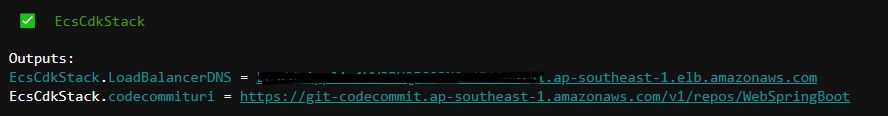
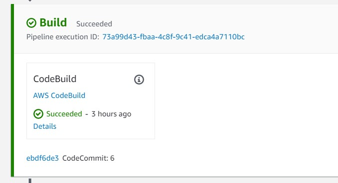
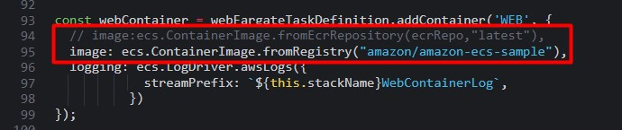

# Amazon CI/CD pipeline deploying to ECS Fargate

This project helps you build a complete Amazon ECS cluster and CI/CD pipeline in **AWS CDK**.

### Procedure to follow:

<b>Step1. Run deploy the first time:</b>

First launch a Cloud9 terminal and prepare it with following commands:

```bash
sudo yum install -y jq
cd ecs-cicd-fargate-cdk/cdk/
chmod -R 777 deploy.sh 
./deploy.sh 
```
Output:


<b>Step2. Commit source code to CodeCommit:</b>

```bash
cd ~/environment/
git clone https://git-codecommit.ap-southeast-1.amazonaws.com/v1/repos/WebSpringBoot
cp -R ecs-cicd-fargate-cdk/web/springboot/* WebSpringBoot/
cd WebSpringBoot/
git add .
git commit -m "first"
git push
```

Check your pipeline:



<b>Step3. Edit Task Definition use image ECR:</b>



Comment line 95 and uncomment line 94

<b>Step4. Redeploy CDK:</b>

```bash
  cd ecs-cicd-fargate-cdk/cdk/
  ./deploy.sh 
```